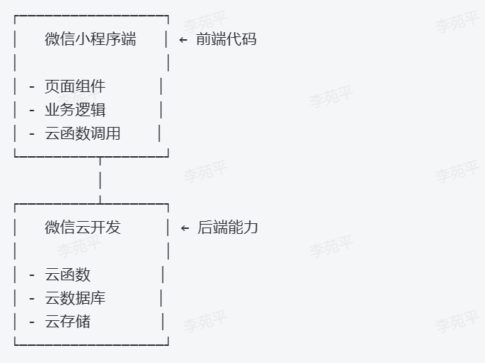

# 南京大学Passion街舞社导师课预约微信小程序 - 项目需求文档

## 1. 项目概述

### 1.1 项目背景

- **问题现状**：南京大学 Passion 街舞社平时训练课程分为队训和导师课，导师课由受邀专业老师授课，仅持导师卡者可参加，卡片包括学期卡、年卡和终身卡三类。目前仍使用实体卡管理，存在以下问题：
  - 实体卡可转卖，存在风险
  - 核验卡片困难
  - 预约流程混乱，易被占名额

- **解决方案**：构建微信小程序，实现导师卡数字化管理，支持在线购卡、验证、预约与签到流程，提升课程管理效率。

### 1.2 项目目标

- 实现导师卡在线化、数字化管理
- 提供可控、可追踪的课程预约与取消功能
- 防止无卡用户占用导师课名额
- 简化管理员发布课程、发卡和签到工作流程

---

## 2. 功能需求

### 2.1 用户端功能

#### 2.1.1 用户认证
- 微信一键登录
- 完善用户信息（姓名、手机号等）

#### 2.1.2 导师卡管理
- 查看导师卡状态与有效期
- 显示卡片类型和是否生效

#### 2.1.3 课程预约
- 按周展示课程列表（时间、导师、舞种）
- 可在课程卡片中直接预约/取消
- 系统自动验证用户卡片有效性
- 操作结果实时反馈

#### 2.1.4 个人中心
- 修改个人信息
- 查看导师卡及有效期
- 查看预约记录

---

### 2.2 管理员端功能

#### 2.2.1 课程管理
- 批量发布每周课程信息（导师、舞种、时间、人数限制）
- 编辑或取消已发布课程

#### 2.2.2 学员管理
- 查询学员信息
- 发放导师卡与激活绑定
- 管理卡片有效状态

#### 2.2.3 预约管理
- 查看课程预约名单
- 对预约学员执行签到核销

#### 2.2.4 系统管理
- 管理员账号创建
- 权限与角色管理

---

## 3. 技术方案

### 3.1 技术架构


第三方服务：

- 微信消息模板（预约成功提醒、上课提醒）
- 微信登录鉴权能力

---

### 3.2 数据库设计

| 表名 | 字段 | 描述 |
|------|------|------|
| `users` | id, openid, nickname, real_name, phone, avatar, status, created_at, updated_at | 用户表 |
| `cards` | id, user_id, card_number, card_type, status, start_date, end_date, created_at, updated_at | 导师卡表 |
| `courses` | id, course_date, start_time, end_time, teacher, dance_type, current_participants, status, week_number, created_at, updated_at | 课程表 |
| `reservations` | id, user_id, course_id, status, checkin_status, created_at, updated_at | 预约记录 |
| `admins` | id, username, password, role, status, last_login, created_at | 管理员表 |

---

## 4. 交互设计要点

### 4.1 用户体验原则

- 操作流简短，不超过两步
- 所有操作均有状态提示
- 页面风格与组件统一
- 支持取消预约等容错机制

### 4.2 核心流程

#### 用户预约流程

微信授权 → 课程列表 → 点击预约 → 系统验证卡片 → 显示成功/失败


#### 管理员课程管理流程

登录后台 → 批量添加本周课程 → 填写课程信息 → 发布成功


#### 管理员导师卡发放流程

查找学员 → 选择卡片类型 → 设置有效期 → 卡片激活


### 4.3 界面布局

课程卡片包含：

- 日期、周几、时间段
- 导师姓名、舞种
- 当前预约人数 / 限制人数
- 动态按钮（预约/取消）
- 卡片状态提示

---

## 5. 核心功能说明

### 5.1 课程列表与预约功能

- 按周展示课程
- 列表页即可预约/取消
- 预约状态实时更新，无须跳转详情页

### 5.2 预约验证机制

预约前自动校验：

- 用户是否有有效导师卡
- 是否在有效期内
- 是否存在同时间段冲突预约

### 5.3 管理员批量课程管理

- 支持导入课程模板
- 支持复制上周课程填充
- 可随时编辑或取消

### 5.4 管理员发卡功能

- 绑定微信用户与导师卡
- 依卡类型自动计算有效期
- 学员即时获得预约权限

### 5.5 签到机制

- 管理员查看预约名单
- 支持扫码签到或列表点击核销

---

## 6. API 接口设计

### 6.1 用户端 API

| 方法 | 路径 | 描述 |
|------|------|------|
| POST | `/api/user/login` | 微信授权登录 |
| GET | `/api/courses/week` | 获取某周课程列表 |
| POST | `/api/reservations` | 预约课程 |
| DELETE | `/api/reservations/:id` | 取消预约 |
| GET | `/api/user/cards` | 获取用户卡片信息 |

### 6.2 管理员端 API

| 方法 | 路径 | 描述 |
|------|------|------|
| POST | `/api/admin/login` | 管理员登录 |
| POST | `/api/courses/batch` | 批量发布课程 |
| PUT | `/api/courses/:id` | 编辑课程 |
| POST | `/api/admin/cards` | 发放导师卡 |
| GET | `/api/reservations/course/:id` | 获取预约名单 |
| POST | `/api/checkin` | 课程签到 |

---

## 7. 项目开发计划

### 开发模式

- 接力式开发：每位成员独立负责一个完整的功能模块（前后端）
- 接口先行：每位开发者需为下一位开发者定义清晰的API接口
- 文档驱动：每个阶段完成后需提供完整的技术文档

### 阶段划分

#### 第一阶段（成员 A）用户认证与基础框架

前端开发
- ✅ 微信小程序框架搭建
- ✅ 用户登录页面
- ✅ 微信授权登录功能
- ✅ 用户信息完善页面
- ✅ 全局状态管理配置
  
后端开发
- ✅ 服务器环境搭建（SpringBoot）
- ✅ 数据库设计与创建
- ✅ 用户表结构实现
- ✅ 微信登录API接口
- ✅ 用户信息管理API
- ✅ 基础中间件配置

交付物

  📁 第一阶段交付

      ├── 前端基础框架

      ├── 用户登录流程

      ├── 数据库初始结构

      ├── API接口文档

      └── 技术交接文档

#### 第二阶段（成员 B）核心业务逻辑

前端开发
- ✅ 课程列表页面（周视图）
- ✅ 课程卡片组件
- ✅ 预约/取消按钮交互
- ✅ 个人中心页面
- ✅ 导师卡信息展示
- ✅ 预约记录列表
  
后端开发
- ✅ 课程表相关API
- ✅ 预约系统逻辑
- ✅ 导师卡验证中间件
- ✅ 预约记录管理
- ✅ 数据验证和错误处理
  
核心功能
- 课程列表按周展示
- 直接预约功能
- 卡片有效性验证
- 预约状态管理
  
交付物

  📁 第二阶段交付

      ├── 完整的用户端功能

      ├── 核心业务API

      ├── 预约验证逻辑
      
      └── 更新版接口文档

#### 第三阶段（成员 C）后台系统与部署

前端开发
- ✅ 管理员登录页面
- ✅ 管理员后台框架
- ✅ 课程管理页面（批量发布）
- ✅ 学员管理页面
- ✅ 预约名单查看
- ✅ 签到功能界面
  
后端开发
- ✅ 管理员认证系统
- ✅ 批量课程发布API
- ✅ 学员管理API
- ✅ 签到核销功能
- ✅ 数据统计接口
- ✅ 系统优化和部署

管理功能
- 周课程批量发布
- 学员信息管理
- 导师卡发放
- 预约名单查看
- 课程签到

交付物

📁 第三阶段交付

      ├── 完整的管理员系统

      ├── 所有功能测试通过

      ├── 部署文档

      └── 最终项目文档
---

## 交接会议安排
- 时间：每个阶段结束时的周末
- 内容：
  - 功能演示
  - 代码讲解
  - 问题解答
  - 下一步计划确认
## 技术协调要点
接口规范
- 使用RESTful API设计
- 统一的响应格式
- 完整的错误码定义

### 响应格式示例

```json
{
  "code": 200,
  "message": "success",
  "data": { ... }
}
